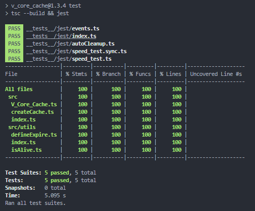

# v_core_cache

Simple Cache Solution for Node and Web.

Sections:

1. 📑 How to use
2. 🚗 Functions and Methods
3. 🎪 Events
4. ➰ Auto Cleanup Expired
5. ❌ Deleted / Removed

___

## 📑 How to use

    const { V_Core_Cache } = require('v_core_cache');
    const cache = new V_Core_Cache();

    // OR

    const { createCache } = require('v_core_cache');
    const cache = createCache();

## 🚗 Functions and Methods

### 1. Get Item Value

    await cache.get(key)  //> anything you put in
    cache.getSync(key)

### 2. Get Whole Cache

Returns all cache.

    cache.getAll() //> object

### 3. Size of Cache

Returns the approximate size of the cache in bytes.

    await cache.size();  //> 1507114 
    cache.sizeSync();

### 4. Has Item?

Returns true if the key exists in the cache and is not expired.

    cache.has(key)   

### 5. Set Item

Set/Create/Update an item in the cache. Will overwrite existing item.

    await cache.set(key, data, expires?)
    cache.setSync(key, data, expires?)  

### 6. Purge cache

Returns true if cache was successfully purged. Otherwise, returns false if cache is already empty.

    await cache.purge()

### 7. Delete item from cache

    await cache.del(key);  //> true/false
    cache.delSync(key);

### 8. Stats

Returns stats about the cache.

    cache.stats() //> { hits: 156, misses: 15, count: 33, size: 1507114 }

### 9. Purge Stats

This basically just resets counters for hits and misses.

    cache.purgeStats()  //> { hits: 0, misses: 0, count: 33, size: 1507114 }

### 10. Get Item Expire Time

Returns the time in milliseconds when the item will expire.

    cache.getExpire(key); //> 150123456789 [ Date.now() + expires]

### 11. Cleanup Expired Items

Returns the number of expired items removed.

    await cache.cleanup(); 

### 12. Count Items

Returns the number of items in cache.

    await cache.count();
    cache.countSync(); 

___

## 🎪 Events

## Management

### 1. Add Event Listener

    cache.addListener("set", (data) => console.log(data));
    // or
    cache.on("set", (data) => console.log(data));

### 2. Remove Event Listener

    cache.removeListener("set", (data) => console.log(data));
    // or
    cache.off("set", (data) => console.log(data));

### 3. Prepend Event Listener

    cache.prependListener("set", (data) => console.log(data));
    // or
    cache.pre("set", (data) => console.log(data));

### 4. Get Registered EventNames

    console.log(cache.eventNames());

### 5. Remove All Listeners

Removes all registered listeners for a single event

    cache.removeAllListeners('set')

### 6. Purge All Listeners

Removes all registered listeners for all registered events

    cache.purgeAllListeners()

## Available events

### 1. SET

Returns {key, value} pair.

    cache.on('set', (item) => console.log(item.key, item.value))

### 1.2 set with key

In this case we are returning the value only.

    cache.on('set/{key}', (value) => console.log(value))

### 2. GET

    cache.on('get', (item) => console.log(data)) //> { key, value } - value can be undefined 

### 3. HIT

    cache.on('hit', (item) => console.log(item)) //> { key, value } 

### 4. MISS

    cache.on('miss', (item) => console.log(item)) //> { key } 

### 5. PURGE

    cache.on('purge', (status) => console.log(status)) //> true/false - can return false if already empty

### 6. PURGE_STATS

    cache.on('purge_stats', (data) => console.log(data)) //> { hits, misses, count, size } - returns stats after purging them.

### 6. cleanup

returns number of affected items

    cache.on('cleanup', (data) => console.log(data)) //> number 

### 6. addListener

New listener added

    cache.on('addListener', (data) => console.log(data)) 

### 6. removeListener

Removed event listener

    cache.on('addListener', (data) => console.log(data)) 

___

## ➰ Auto Cleanup Expired

    const V_Core_Cache = require('v_core_cache');
    const cache = new V_Core_Cache({ cleanInterval: 250 }); // Number in milliseconds 

> **NOTE**: When using autoCleanup you should stop the cleanup interval by calling `cache.stopCleanup()`

___

## **✅ Tests and Coverage with Jest**

